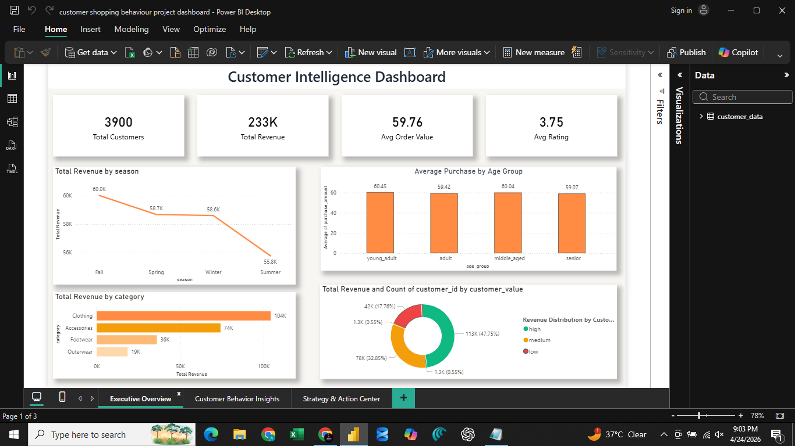
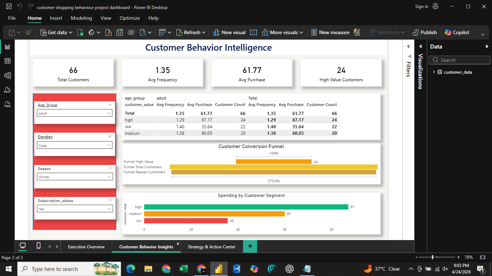
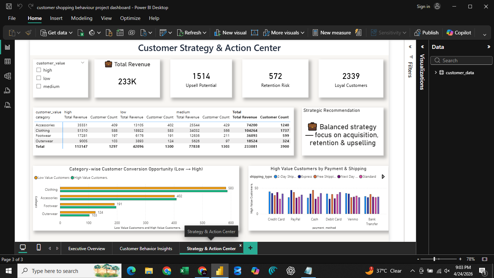

# 🚀 Customer Purchase Behavior & Revenue Optimization Analysis

---

## 📌 Overview

This project analyzes customer shopping behavior to uncover patterns in purchasing, segmentation, and revenue generation.

The objective is to help businesses improve **customer retention, conversion, and revenue optimization** using data-driven insights.

---

## 🧠 Problem Statement

Businesses often struggle to understand:

* Which customers generate the most revenue
* What drives repeat purchases
* Where customer drop-offs occur
* How to improve conversion and upselling

Without proper analysis, companies risk losing revenue and inefficiently targeting customers.

---

## 🎯 Objectives

* Segment customers into high, medium, and low value groups
* Analyze purchasing behavior and spending patterns
* Identify revenue drivers across categories and seasons
* Evaluate customer conversion and retention
* Provide strategic recommendations for business growth

---

## 🛠️ Tools & Technologies

* **SQL Server (SSMS)** – Data extraction
* **Python (Pandas, NumPy, Matplotlib, Seaborn)** – Data analysis
* **Power BI** – Dashboard & visualization

---

## 📂 Dataset

* Customer shopping behavior dataset
* ~3,900 customers analyzed

Includes:

* Demographics (age, gender)
* Purchase data (category, amount)
* Customer frequency & behavior
* Discounts and promo usage
* Ratings and experience

---

# 📊 Dashboard Preview

## 📌 1. Executive Overview



**Key Metrics:**

* Total Customers: **3900**
* Total Revenue: **233K**
* Avg Order Value: **59.76**
* Avg Rating: **3.75**

**Insights:**

* Revenue varies across seasons
* Clothing & accessories dominate sales
* Purchase value consistent across age groups

---

## 📌 2. Customer Behavior Insights



**Key Metrics:**

* Avg Frequency: **1.35**
* Avg Purchase: **61.77**
* High Value Customers: **24**

**Insights:**

* Customer funnel shows drop-off in repeat purchases
* High-value customers contribute significantly more revenue
* Filters enable segmentation by age, gender, and season

---

## 📌 3. Strategy & Action Center



**Key Metrics:**

* Upsell Potential: **1514**
* Retention Risk: **572**
* Loyal Customers: **2339**

**Insights:**

* Strong opportunity to convert low-value customers
* Retention risk highlights need for engagement strategies
* Category-level analysis shows conversion potential

---

## 🔍 Key Analysis

### 📊 Customer Segmentation

* Customers categorized into **high, medium, low value**
* High-value customers drive majority revenue

---

### 📊 Revenue Analysis

* Total revenue: **233K**
* Top categories: Clothing, Accessories
* Seasonal variation affects performance

---

### 📊 Customer Behavior

* Low purchase frequency → growth opportunity
* High-value customers show strong spending patterns

---

### 📊 Funnel & Conversion

* Drop-off between total and repeat customers
* Indicates need for retention strategies

---

## 💰 Business Impact

* Identified **high-value customers driving revenue**
* Highlighted **retention gaps using funnel analysis**
* Discovered **upsell opportunities (1514 customers)**
* Identified **572 customers at risk of churn**
* Provided **category-level strategy insights**

---

## 💡 Key Business Insights

* Focus on retaining high-value customers
* Convert low-value customers with targeted offers
* Improve repeat purchase rate
* Optimize category focus for higher revenue
* Use segmentation for personalized marketing

---

## 📁 Project Structure

```
customer-behavior-analysis/
│── customer_analysis.ipynb
│── customer_queries.sql
│── customer_dashboard.pbix
│── dashboard1.png
│── dashboard2.png
│── dashboard3.png
│── README.md
```

---

## 📈 Resume Highlights

* Analyzed ~3,900 customers to identify purchasing behavior trends
* Built 3-layer Power BI dashboard (Executive, Insights, Strategy)
* Identified high-value segments and revenue drivers
* Designed retention and upselling strategies using data insights
* Delivered actionable recommendations for revenue optimization

---

## 🚀 Future Improvements

* Customer Lifetime Value (CLV) modeling
* Churn prediction model
* Recommendation system

---

## 🤝 Connect

If you found this project useful or want to collaborate, feel free to connect!
